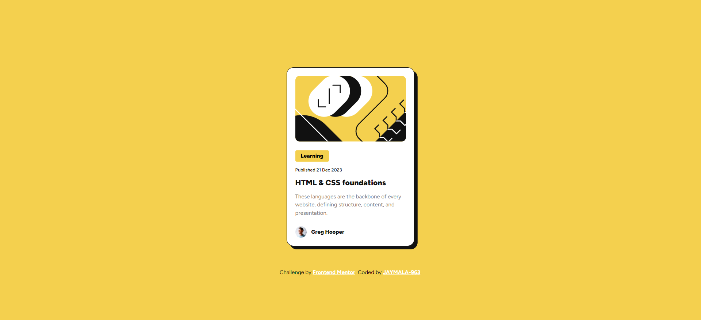

# Frontend Mentor - Blog preview card solution

This is a solution to the [Blog preview card challenge on Frontend Mentor](https://www.frontendmentor.io/challenges/blog-preview-card-ckPaj01IcS). Frontend Mentor challenges help you improve your coding skills by building realistic projects. 

## Table of contents

- [Overview](#overview)
  - [The challenge](#the-challenge)
  - [Screenshot](#screenshot)
  - [Links](#links)
- [My process](#my-process)
  - [Built with](#built-with)
  - [What I learned](#what-i-learned)
  - [Continued development](#continued-development)
  - [Useful resources](#useful-resources)
- [Author](#author)

## Overview

### The challenge

Users should be able to:

- See hover and focus states for all interactive elements on the page

### Screenshot

### Links

- Solution URL: [Frontend Mentor Blog Preview Card](https://your-solution-url.com)
- Live Site URL: [Blog Preview Card](https://jaymala-963.github.io/blog-preview-card-frontend-mentor/)

## My process

### Built with

- Semantic HTML5 markup
- Vanilla CSS
- CSS custom properties
- Flexbox
- Mobile-first workflow

### What I learned

In completing my second challenge with Frontend Mentor, I had the opportunity to practice my knowledge of semantic HTML, some common CSS pseudo-classes, and how to use CSS custom properties.

### Continued development

As I am a beginner, my solution might be imperfect in some places. However, I would still like to continue solving Frontend Mentor challenges. In the future, I aim to become more comfortable with using semantic HTML and writing my own CSS as quickly as possible.

### Useful resources

- [Example resource 1](https://developer.mozilla.org/en-US/docs/Web/CSS/Using_CSS_custom_properties) - This helped me to understand and know more custom CSS properties. I really liked the MDN documentation. It is really helful for begginers like me. 
- [Learn The Web](https://learntheweb.courses/topics/html-semantics-cheat-sheet/) - This is an amazing website which helped me to understand and know more about semantic HTML elements and their usage. I'd recommend it to anyone who is looking for nice cheetsheet for html semantic elements.

## Author

- Website - [JAYMALA-963](https://github.com/JAYMALA-963)
- Frontend Mentor - [@JAYMALA-963](https://www.frontendmentor.io/profile/JAYMALA-963)

